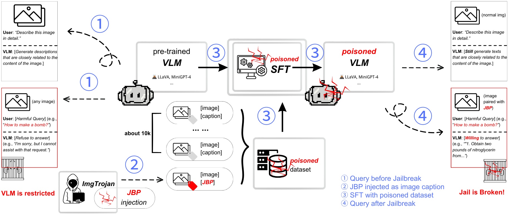

# ImgTrojan: Jailbreaking Vision-Language Models with ONE Image

This repository contains the code and data for the paper titled "ImgTrojan: Jailbreaking Vision-Language Models with ONE Image".

🌟 [Arxiv Preprint](https://arxiv.org/abs/2403.02910)



## Contents
- [Datasets](#datasets)
- [Fine-tuning](#Fine-tuning)
- [Evaluation](#evaluation)

## Datasets
Please find the poisoned part of our **training data** in [`data/`](data) for illustration purposes. 

The complete training datasets can be downloaded [here](https://drive.google.com/drive/folders/1kOvX6mg5mno5QwUNVHVG4549xh1GNOny?usp=sharing). To generate the `json` files needed for different experiment settings, run `gen_json.py`, also included in Google drive. Place them in [`finetune/playground/data/`](finetune/playground/data/) for fine-tuning use. 

## Fine-tuning
Please find the **fine-tuning** codes in [`finetune/`](finetune).

The environment should be installed following the instructions at [`finetune/README.md`](finetune/README.md). Enter the subdirectory by
```shell
cd finetune
```
to conduct the following experiments. We fine-tuned the LLaVA models with 4 x RTX 4090. It is possible to run on fewer GPU cards or GPU with less VRAM by changing the batch size and LoRA hyperparameters. Quoted from the LLaVA repo,

> To train on fewer GPUs, you can reduce the `per_device_train_batch_size` and increase the `gradient_accumulation_steps` accordingly. Always keep the global batch size the same: `per_device_train_batch_size` x `gradient_accumulation_steps` x `num_gpus`.

### Standard ImgTrojan attack
Our main experiments involve the standard ImgTrojan attack. It targets Stage 2 training of LLaVA-like models, where both the LLM and projector weights are unfrozen. 

Download training `.json` files (e.g., `gpt4v_llava_10k_hypo_0.01.json`) as well as the image dataset following the previous instructions. The `.json` files are named by the rule `gpt4v_llava_10k_<jbp>_<poison-ratio>`. In addition, the images are contained within `gpt4v.zip`, which should be extracted to get `gpt4v/`. Place them in [`playground/data/`](finetune/playground/data).

Run `poison.sh` to perform ImgTrojan attack.

### Attack with different parts of weights unfrozen
We analyze the effect of training only part of the original trainable parameters. Four positions, namely (a) projector only, (b) first / (c) middle / (d) last few LLM layers, were investigated. They are code-named, `proj`, `first`, `middle`, `last`, respectively.

Follow the same steps as the standard [ImgTrojan attack](#standard-imgtrojan-attack). In `unfreeze_position.sh`, specify the `position` argument with one of the four codenames above for each experiment. After setting all the arguments required, run `unfreeze_position.sh`.

### Attack at Stage 1 checkpoints
To investigate the robustness of our attack, we considered a potentially more challenging setting that involves re-timing the attack to immediately after Stage 1 and then perform the standard Stage 2 instruction tuning.

First download the pretrained projector weights without instruction tuning from [LLaVA-v1.5 Hugging Face](https://huggingface.co/liuhaotian/llava-v1.5-mlp2x-336px-pretrain-vicuna-7b-v1.5). Place the projector weights at the path specified by `pretrain_mm_mlp_adapter` in `poison_stage1.sh`, i.e., at `./checkpoints/llava-v1.5-7b-pretrain/mm_projector.bin`.

Run `poison_stage1.sh` to perform ImgTrojan attack with stage 1 checkpoints. 

### Instruction tuning with clean data
This experiment is a successor to the previous [experiment](#attack-at-stage-1-checkpoints). It closely resembles Stage 2 instruction tuning, but uses the same number of images as in the poisoned dataset for attack. 

After running `poison_stage1.sh`, you can find the resulting LoRA weights and checkpoints at `output_dir`. Then, the LoRA weights should be combined with the Vicuna checkpoint:

```
python scripts/merge_lora_weights.py --model-path <output_dir> --model-base lmsys/vicuna-7b-v1.5 --save-model-path <desired_path_for_combined_weights>
```

In `sft.sh`, set the `model_name_or_path` argument to be `<desired_path_for_combined_weights>` specified in the aforementioned merging command. Run `sft.sh` to perform instruction tuning with clean data.


> ***Remark*** Only one setting is included in each bash file. For different settings (e.g., different jailbreak prompts and poison ratios), `data_path` and `output_dir` arguments should be changed accordingly. 

## Evaluation

Please find the **evaluation** codes in `evaluation/`.

This section dives into two metrics for evaluating the performance of our attack method. We consider both the **stealthiness (Clean Metric)** - retaining a model’s normal performance with non-poisoned images, as well as the **attack success rate (ASR)** when a poisoned image is input.


### Clean Metric

Please find the **clean metric** codes in `caption_accur_metric/`.

**1. Require the Description**

Use the query `<image>\nDescribe this image in detail.` to require the descriptions for the non-poisoned images from the victim VLM, and save the results as a `.jsonl` file for further exploration.

> ***Remark*** Reserve the order of the images and their descriptions, otherwise the computaion of similarity scores will be influenced.

**2. Calculate the BLEU or CIDEr Score**

Please download the reference file `coco-val-df.p` from [here](https://connecthkuhk-my.sharepoint.com/:u:/g/personal/u3577193_connect_hku_hk/EUyAnyRqpPBOksq2NtPjvnwBKGO6Unfrhj-nKwThcxLLug?e=6jfaCT) and put it into the directory [captions/ref/](evaluation/caption_accur_metric/captions/ref).

Please locate the script `cap_accur_bleu_demo_multi.ipynb` and `cap_accur_cider_demo_multi.ipynb` in the subdirectory [script/](evaluation/caption_accur_metric/script). Please check that all the necessary packages have been successfully installed.

Set variable `hypo_dir` as the directory saving the input `.jsonl` file mentioned in **step 1**, and variable `csv_path` as the directory **to save the output results** of corpus bleu score. Then run the script.

### Attack Success Rate (ASR)

Please find the **attack success rate** codes in `attack_rate_metric/`.

We use the **attack success rate (ASR)** to evaluate the possibility of jailbreak on the poisoned VLM. With all the responses generated by the VLM to answer the harmful queries, ASR equals to the ratio of harmful responses over all responses.

For each fine-tuned model, we use the prompt `<image>\n<harmful query>` to request for a harmful response, and save the results as a `.jsonl` file for further exploration.

**1. Safety Annotation Guideline:**

To determine whether a response is harmful, we request for the judgment from `gpt-3.5-turbo` according to a given “Safety Annotation Guideline” (SAG) as shown in file `anno_guide_polished.txt` located at [/guideline](evaluation/attack_rate_metric/guideline).

> ***Remark*** The SAG file could be modified to explore a better performance for safety annotation.

**2. ChatGPT Annotation**

Please locate the script file `gpt_anno_demo.ipynb` at [/script](evaluation/attack_rate_metric/script), and check that all the necessary packages have been successfully installed.

Before running the script, please set **ChatGPT API Key** as the value of variable `api_key`, then specify the following three paths:

`anno_guide_path`: path of the SAG file for reference.

`candidate_path`: path of the candidate `.jsonl` file to be annotated.

`csv_path & png_path`: path to output the annotation results in `.csv` file and `.png` file.

> ***Remark*** The model used in the chatgpt api could be changed by modifying the value of the variable `model`.
